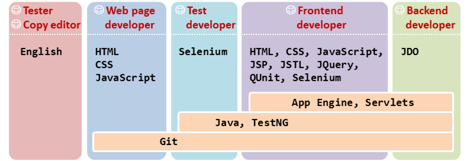

# **Contributor Orientation Guide**

We welcome contributions from anyone, in particular, students (see [here](https://teammatesv4.appspot.com/about.html) for a list of our contributors). One of the main objectives of TEAMMATES is to help students get experience in a OSS production environment. Here are some information that might be useful to would-be contributors.

[Knowledge required](#h.abftcg92xk1k)

[Workload](#h.8yn20iebwilp)

[Getting started](#h.4es3v3yquxal)

[Contacting us](#h.5lngkuxtl5mo)

* * *

## Knowledge required

Although TEAMMATES uses many tools and technologies, you need not know all of them before you can contribute. The diagram below shows which technologies you need to learn to contribute in different roles. As you can see, some roles don't need learning any technologies at all. Note that these role aren't fixed or formally assigned. It is simply for guidance only.

Roles:

* **Tester**: Tests the App manually and reports bugs or suggestions for enhancements in the issue tracker.
*   **Copy editor**: Helps in improving documentation.
*   **Web page developer**: Works on static web pages, such as those used in the TEAMMATES web site
*   **Test developer**: Works on automating system tests.
*   **Frontend developer**: Works on the frontend of the App that is generated dynamically from the server side.
*   **Backend developer**: Works on the backend logic of the App, including data storage.

## Workload

[TEAMMATES community](https://teammatesv4.appspot.com/about.html) has three tiers, defined based on the level of involvement.

*   Contributor: Small but noteworthy contribution to the project.
*   Committer: Significant contributions sustained over a long period of time.
*   Core member: Significant and sustained contributions in recent times. Core members can progress through the levels: Snr Developer, Area Lead, Project Lead, and Project Manager.

## Getting started

Contributing to an OSS project requires you to figure out things on your own when you can, and seek help from the right resource when you cannot. To become a TEAMMATES contributor, you need to start honing those skills. To help you with that, we have created a sequence of tasks you can try to complete.  Try to complete as many of them as you can, in the order they are listed. Of course we are happy to guide you if you encounter any difficulties when doing these tasks; just post your question in [our issue tracker](https://github.com/TEAMMATES/teammates/issues). If you are seeking help on project setup, remember to include the following in your post.

1. Step in the setting up guide that you are in

2. What measures you took to address the issue

3. Operating system

4. Screenshots (if any)

> Note: The task descriptions are brief by intention. We want you to try to figure out how to do those things by yourself.

## Orientation task list

_**Phase A**: Know the project_

1.  Understand what TEAMMATES is about.<>
    * [product intro page](https://teammatesv4.appspot.com) shown to potential users

    * [project vision, challenges, and principles](http://teammatesv4.appspot.com/dev/devman.html%23project)
    * [feature overview](https://teammatesv4.appspot.com/features.html) (users’ point of view)

2.  Decide in which role(s) you want to contribute. i.e., tester, copy-editor, etc. as specified [earlier in this document](#id.49lgk6iu1w59).
3.  If you are aiming for tech writer or tester roles, get an instructor account using the link in the TEAMMATES home page. Remember to mention the purpose of your request under any other comments.

    If you are sure you want to become a contributor, you can skip this step. In Phase B, you get to set up TEAMMATES on your own machine and use that instance to try the functionality.

    If you plan to contribute code, continue with the tasks below.

_**Phase B**: Set up locally_

1.  Set up TEAMMATES development environment on your computer.  
    Important:  
    * Follow instructions to the letter. _Install the specified versions of the tool stack, not the latest versions._  
    * If you encounter any problems, refer to the [Developer Troubleshooting Guide](https://www.google.com/url?qhttps://docs.google.com/document/d/1_p7WOGryOStPfTGA_ZifE1kVlskb1zfd3HZwc4lE4QQ/pub?embedded%3Dtrue&sa=D&ust=1458427634398000&usg=AFQjCNGVBlVtbfAZEnGnVwGudarEORsfRw).
2.  Get dev green. It is OK to proceed to the next phase if you have fewer than 5 failing test cases.

_**Phase C**: Deploy_

1.  Deploy your own copy of TEAMMATES to your staging server.

_**Phase D**: Tinker with the code_

1.  Fork our repo at GitHub
2.  Create a branch named ‘tinker’
3.  In that branch, do a small change to the code that makes a visible change to TEAMMATES UI. Preferably, your change should improve the UI in some way, or at least not make it worse.
4.  Deploy the changed version to your staging server.
5.  Push your changes to your fork.
6.  Create a new issue in our issue tracker with the following info  
    Issue title: ‘New contributor self intro [your name]’    
    a) the link to your app  
    b) link to your fork  
    c) a screenshot of the change you did (as seen on the UI)  
    d) your real name and a short self-intro

_**Phase E**: Start contributing_
After you complete the above tasks, you are ready to become a contributor. Steps for fixing an issue is explained in the [process](https://github.com/TEAMMATES/repo/blob/master/devdocs/process.md) document. New contributors are advised to start doing an issue labeled d.FirstTimers (but do not do more than one of those), move to other issues labeled as d.Contributors  

#### **_Important:_**

Fixing an issue quickly is not the important thing. In fact, issues given to new contributors are ones we already know how to fix. We are more interested to see how you go about fixing the issue. We want to know whether you are systematic and detail-oriented.  
Take your time to learn and follow the workflow to the letter. Do not skip any steps because you think that step is 'not important'. We are more impressed when you finish an issue in fewer attempts than when you finish it in a shorter time but take many attempts because you were not meticulous enough along the way.  

## Contacting us

The best way to contact us is to [post a message in our issue tracker](https://github.com/TEAMMATES/teammates/issues/new). Our issue tracker doubles as a discussion forum. You can use it for things like asking questions about the project or requesting technical help.

Alternatively (less preferred), you can **email** us at teammates[at]comp.nus.edu.sg
